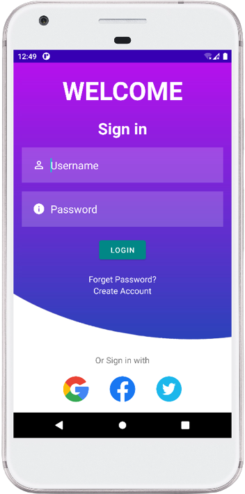
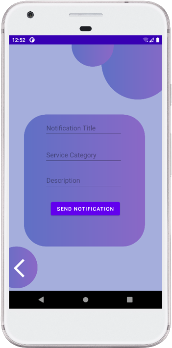
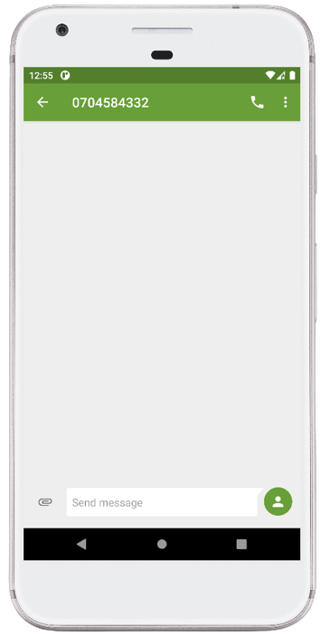

# MAD_Project
This is my 2nd year 2nd semester mini project named "Easy Works" regarding Mobile Application Development module done by kotlin language. 

# Table of Contents
- [App Name](#app-name)
- [Description](#description)
- [Tools And Technologies](#tools-and-technologies)
- [User Interfaces](#user-interfaces)

# App Name
Easy Works

# Description
This is an Android app designed to tackle economic challenges by offering freelancing services. It has two user types: freelancers and customers. Both need to sign up to use the app. Freelancers can showcase their skills by listing services they offer. Customers can browse these services, choose what they need, and easily communicate with freelancers through messages and calls.

# Tools And Technologies
- Android Studio
- Kotlin language
- Firebase realtime database
- Firebase Authentication
- Version Control(Git)

# User Interfaces
 

